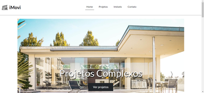
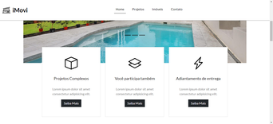
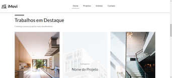
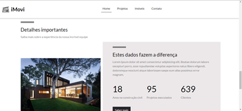
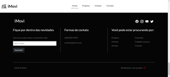
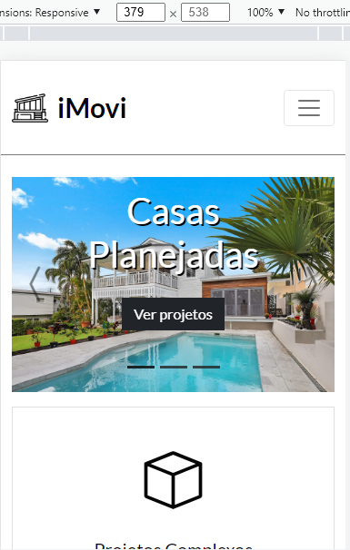
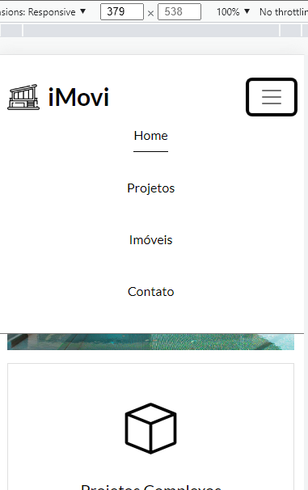
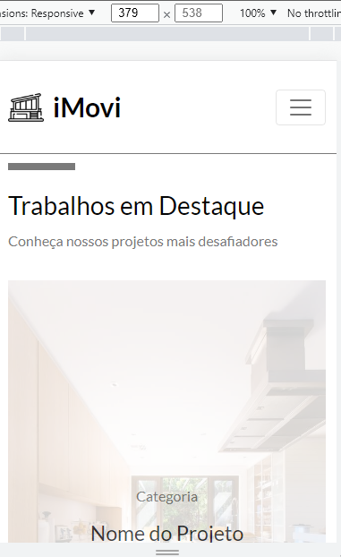
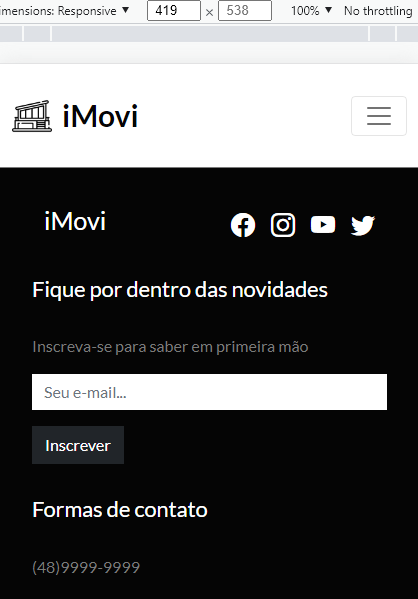

<h1 align="center">Welcome to iMovi 👋</h1>

  

> Home page of a real estate company

    <a href='#about-the-project'>• About the project</a>  
    <a href='#screenshots'>• Screenshots</a>  
    <a href='#how-to-use'>• How to Use</a>  
    <a href='#features'>• Features</a>    
    <a href='#learnings'>• Learnings</a>
    <a href='#author'>• Author</a>  
    <a href='#show-your-support'>• Show Your Support</a>
    <a href='#license'>• Licence</a>    

🚀Project Completed ✅ 

## 💻 About the Project

This project consists of a simple home page to promote a fictitious real estate company. The purpose of the project is to serve for didactic purposes, allowing to train front-end web development skills using Bootstrap 5. This project was developed during a youtube tutorial of the channel called ["Matheus Battisti - Hora de Codar"](https://www.youtube.com/c/MatheusBattisti), but with some changes, of course.

## 🎨 Screenshots
### Desktop / Laptop 

### Mobile 

**[website hosted on Github Pages](https://gustavo-victor.github.io/imovi/#) 

## 🚀 How to Use

Before you start, you will need to install [Git](https://git-scm.com/) and also a powerful code editor like [Visual Studio Code](https://code.visualstudio.com/) to clone, test and modify this repository on your machine. To understand the code, you need to know the basics of HTML and CSS.

## 🛠 Features

The following tools were used in building this project.
### Languages 
- [HTML5](https://developer.mozilla.org/pt-BR/docs/Web/HTML)
- [CSS3](https://developer.mozilla.org/pt-BR/docs/Web/CSS) 
### Frameworks and Libraries
- [Bootstrap 5](https://getbootstrap.com/)
### Utilities
- Fonts: [Lato](https://fonts.google.com/specimen/Lato?query=Lato)
- Icons: [Bootstrap Icons](https://icons.getbootstrap.com/)

## 🏅 Learnings

During the development of the project, I was able to learn more about how to make navigation, carousel, and create responsive and mobile-friendly layouts with Bootstrap 5 in practice.
## 👤 Author

**Gustavo Victor**

* Github: [@Gustavo-Victor](https://github.com/Gustavo-Victor)
* LinkedIn: [@gustavo-victor-575b93206\/](https://linkedin.com/in/gustavo-victor-575b93206\/)

## Show your support

Give a ⭐️ if this project helped you!

## 📝 License

Copyright © 2022 [Gustavo Victor](https://github.com/Gustavo-Victor). 
This project is [MIT](./LICENSE) licensed. Anyone can use and contribute to this project.

***
_This README was generated with ❤️ by [readme-md-generator](https://github.com/kefranabg/readme-md-generator)_ (but with some additions and modifications). 
